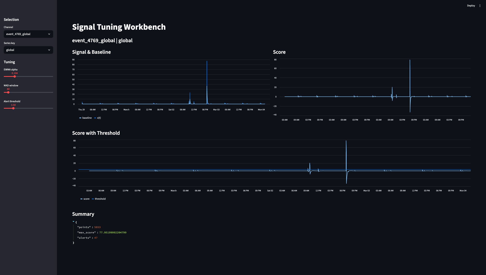
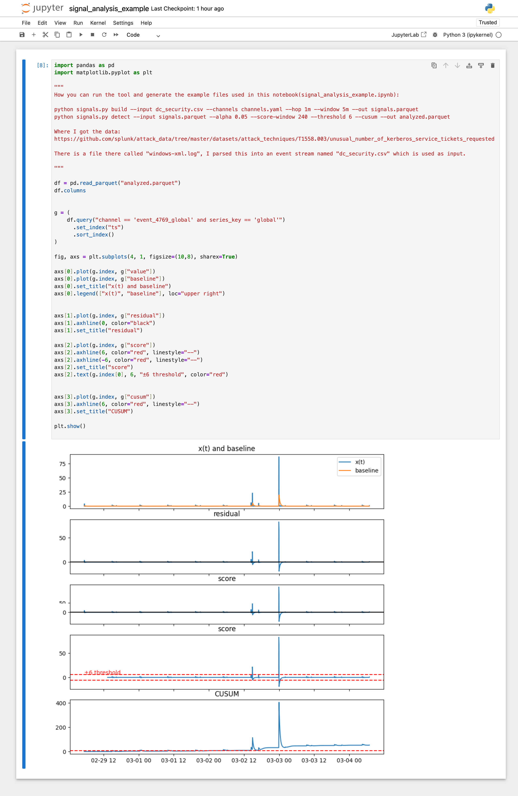

# Signals

A small command-line tool for building hop-based time-series signals from event data and running baseline-driven anomaly detection.

This project is intentionally minimal and exploratory. It focuses on **signal construction, baselining, and scoring**, while keeping ingestion, alerting, and domain-specific logic out of scope.

The core idea is to treat event streams as signals, apply simple but robust DSP-style techniques, and provide tooling to **understand and tune behavior**, not just emit alerts.

---

## Build signals

The `build` command converts an event stream into one or more time-series signals.

```bash
python signals.py build \
  --input dc_security.csv \
  --channels channels.yaml \
  --hop 1m \
  --window 5m \
  --out signals.parquet
```

Conceptually, this step:

- Reads a normalized event stream
- Buckets events into overlapping or non-overlapping time windows
- Emits numeric signals `x(t)` per channel and series key

The output is a long-form signal table with columns such as:

- `ts`
- `channel`
- `series_key`
- `value`

---

## Detect anomalies

The `detect` command applies baselining and robust scoring to previously built signals.

```bash
python signals.py detect \
  --input signals.parquet \
  --alpha 0.05 \
  --score-window 240 \
  --threshold 6 \
  --out scored.parquet
```

This stage typically includes:

- EWMA baselining
- Residual computation
- Robust MAD-based scoring
- Optional thresholding or alert extraction

The output augments the signal table with columns such as:

- `baseline`
- `residual`
- `score`
- `is_alert`

---

## Interactive tuning (Streamlit)

In addition to the command-line workflow, the repository includes a lightweight **Streamlit-based tuning workbench** for interactive exploration of signals and scoring parameters.

The Streamlit app operates on pre-built signal files (for example, `signals.parquet`) and provides:

- Interactive selection of channel and series key
- Live tuning of EWMA smoothing (`alpha`)
- Live tuning of robust scoring parameters (MAD window, threshold)
- Immediate visual feedback on baselines and scores

This is intended as a **tuning and analysis aid**, not as a production UI.

### Run the Streamlit tuner

From the repository root:

```bash
uv run streamlit run apps/tune.py
```

By default, the app reads signal data from:

```
examples/k-test/signals.parquet
```

### Example: live signal tuning



---

## Example output

The repository also includes a Jupyter notebook demonstrating signal construction and scoring on sample data.



This notebook serves as a reference for:

- Understanding how signals are constructed
- Inspecting baselines and residuals
- Validating scoring behavior

---

## Project intent

This project focuses on treating event streams as time-series signals and applying simple, inspectable DSP-style techniques for baselining and scoring.

The emphasis is on:

- Clear signal construction from event data
- Robust, interpretable baselines and scores
- Rapid tuning and experimentation

Planned extensions include multi